# Final Project Report

## Thông Tin Dự Án (Solo)

| | |
|---|---|
| **Hình thức** | Dự án cá nhân (Solo) |
| **Tên dự án** | WorldWords - IELTS Vocabulary |
| **GitHub Repository** | [Dragons212122/WorldWords](https://github.com/Dragons212122/WorldWords) |
| **Ngày nộp** | chưa xong |

### Sinh viên thực hiện

| Họ tên | MSSV | Vai trò |
|---|---|---|
| Phạm Ngọc Kha | 24020002 | Fullstack Developer |

---

## Tổng Quan Project và Công Nghệ Sử Dụng

**Mô tả ứng dụng:**

WorldWords là một ứng dụng học từ vựng IELTS Academic hiệu quả với phương pháp hiện đại. Ứng dụng cung cấp các công cụ như Flashcards, Quiz tương tác, Phát âm (Text-to-Speech) và theo dõi tiến độ học tập (XP, Streak) giúp sinh viên và học viên IELTS ôn luyện từ vựng một cách tối ưu.

**Tech stack:**

| Layer | Công nghệ |
|---|---|
| Frontend | React.js, Vite, Tailwind CSS v4, Lucide React |
| Backend / Auth | Firebase Authentication |
| Database | Firebase Firestore / LocalStorage (Demo Mode) |
| Deploy | GitHub Pages |

**Tính năng chính:**

- Xác thực người dùng (Đăng nhập, Đăng ký, Quên mật khẩu).
- Thư viện từ vựng chia theo chủ đề (Academic, Business, Research, v.v.).
- Học từ vựng qua Flashcards lật 3D có tích hợp phát âm tiếng Anh.
- Làm Quiz trắc nghiệm đánh giá kiến thức và tích lũy điểm XP.
- Dashboard cá nhân hiển thị tiến độ học tập và cấp bậc rank.

---

## Hướng Dẫn Cài Đặt và Chạy Ứng Dụng

**Yêu cầu hệ thống:**

| Công cụ | Phiên bản |
|---|---|
| Node.js | >= 18.x |
| npm | >= 8.x |

**Các bước cài đặt:**

```bash
# 1. Clone repository
git clone https://github.com/Dragons212122/WorldWords.git
cd WorldWords

# 2. Cài đặt dependencies
npm install

# 3. Khởi động ứng dụng (Development mode)
npm run dev

# 4. Build dự án (Production mode)
npm run build
```

---

## Task 1 — Project Planning & Teamwork

### (a) Phân công vai trò

Do đây là dự án cá nhân, sinh viên tự thực hiện toàn bộ từ thiết kế UI/UX, lập trình Frontend bằng React và Tailwind CSS, đến tích hợp Backend bằng Firebase. Đồng thời tự cấu hình triển khai ứng dụng lên GitHub Pages.

### (b) Wireframe

- **Tool sử dụng:** Figma / Code Prototype
- **Figma Design:** [WorldWords Figma](https://www.figma.com/design/4W4F6vhFcCsok2Rd3iuJNw/final-%C6%B0eb?node-id=3-2&m=dev&t=I4mtPhyTo0iXwuS8-1)
- **Các trang đã thiết kế:**
  - [x] Homepage
  - [x] Topic Catalog
  - [x] Flashcards
  - [x] Auth Page (Login / Register / Forgot Password)
  - [x] Dashboard & Profile

### (c) Project Plan

**Milestones:**

| Milestone | Trạng thái |
|---|---|
| Khởi tạo dự án & Setup môi trường | Hoàn thành |
| Xây dựng UI Component (Cards, Buttons, Navigation) | Hoàn thành |
| Tích hợp dữ liệu từ vựng & Flashcards 3D | Hoàn thành |
| Triển khai Animation và Refactor Auth | Hoàn thành |

### (d) GitHub Repository

- **Repository link:** [Dragons212122/WorldWords](https://github.com/Dragons212122/WorldWords)

### (e) Quy trình làm việc trên GitHub

Dự án được thực hiện cá nhân, do đó quy trình làm việc sử dụng Git tập trung vào việc tạo các nhánh tính năng (feature branches) để kiểm soát phiên bản. Các tính năng mới được phát triển và kiểm tra kỹ thông qua các **Pull Requests (PRs)** trước khi được merge vào nhánh `main`. Tổng cộng dự án đã tạo và merge thành công **14 Pull Requests**.

**Danh sách các Pull Requests tiêu biểu đã hoàn thành:**
- `fixing bug` (Sửa lỗi UI/Logic)
- `imporved mobile` (Tinh chỉnh giao diện di động)
- `Project Structure Refactor & Core Feature Completion` (Tái cấu trúc và hoàn thiện tính năng lõi)
- `Task 4/optimization` (Tối ưu hóa hiệu năng)
- `[Task 3] Database Integration and Dynamic Content Development` (Tích hợp dữ liệu động)
- `[Task 2] Implement Multi-page UI and Responsive Design` (Xây dựng UI đa trang)
- `[Task 1] Project Planning and Workflow Setup` (Thiết lập cấu trúc dự án)

**Ví dụ commit messages tiêu biểu:**

```
feat: finalize UI with images
fix: update image paths to match new filenames in publics/imgs
Merge updates from task-4/optimization
```

---

## Task 2 — Implement User Interface

### (a) Main UI & Features (Giao diện chính)

Dưới đây là các giao diện nổi bật và chức năng chính của ứng dụng:

**1. Trang Chủ (Home)**
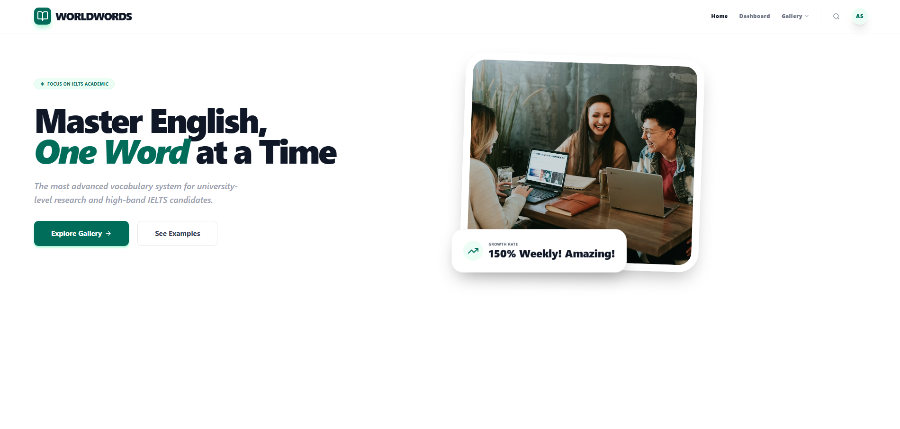

**2. Giao diện Thư viện Chủ đề (Gallery)**
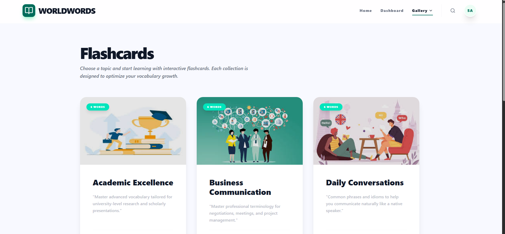

**3. Màn hình Học Flashcards 3D**
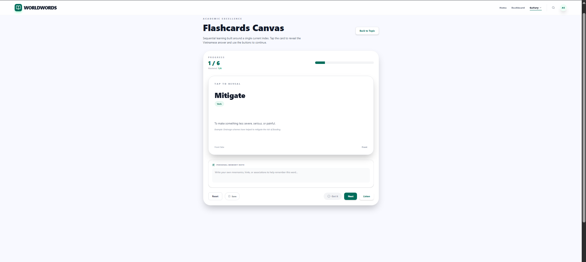
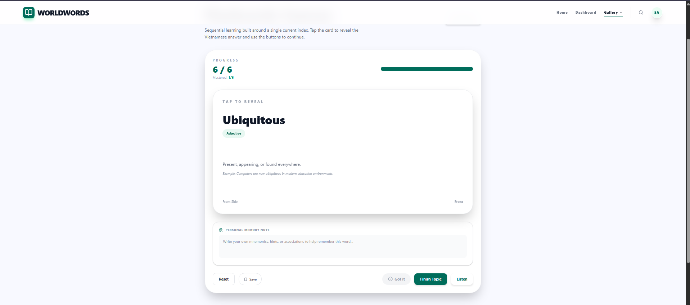

**4. Dashboard Người Dùng**
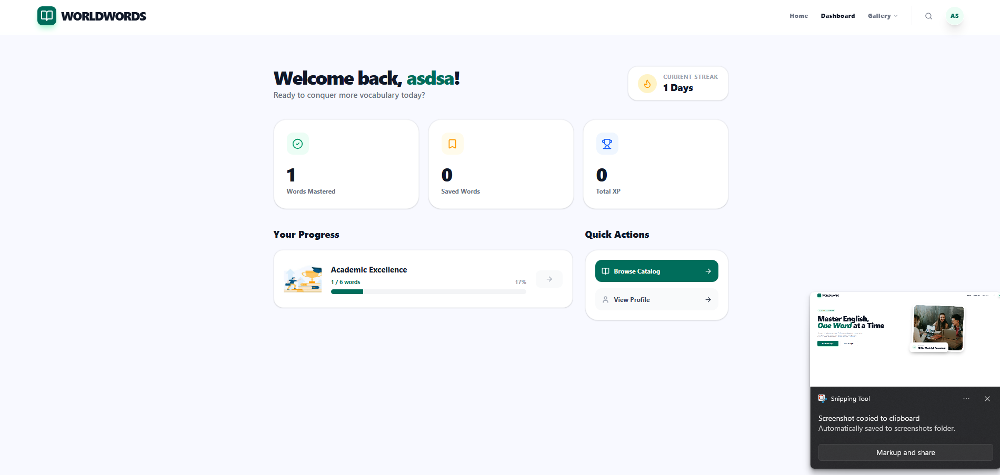

**5. Xác thực Người dùng (Login / Register)**
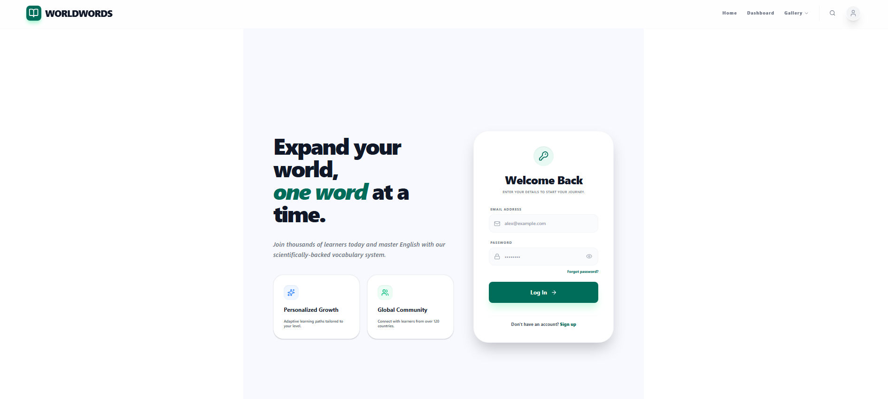
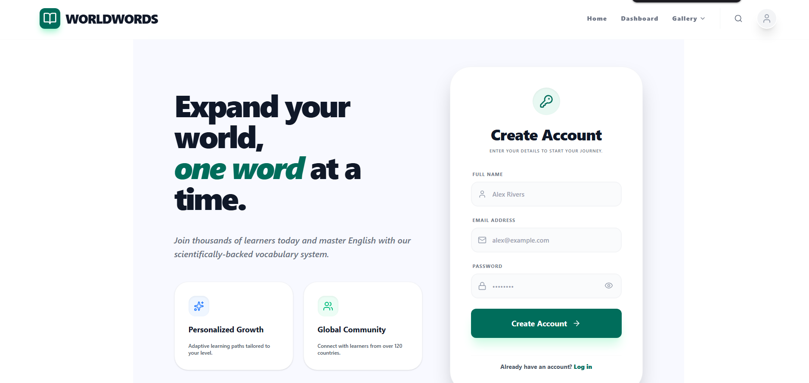

**6. Hồ sơ Cá nhân (Profile)**
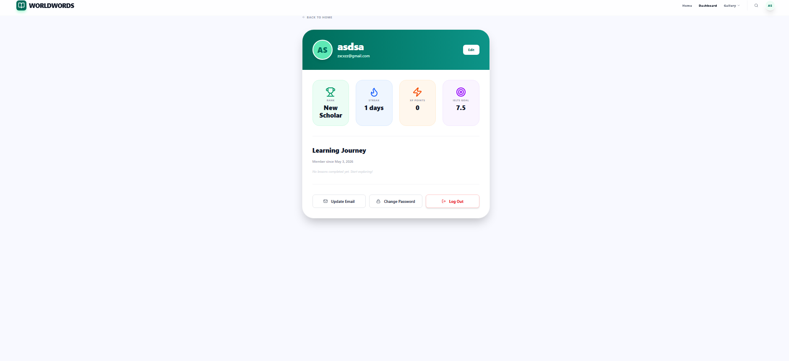

**7. Bài Kiểm tra Từ vựng (Quiz)**
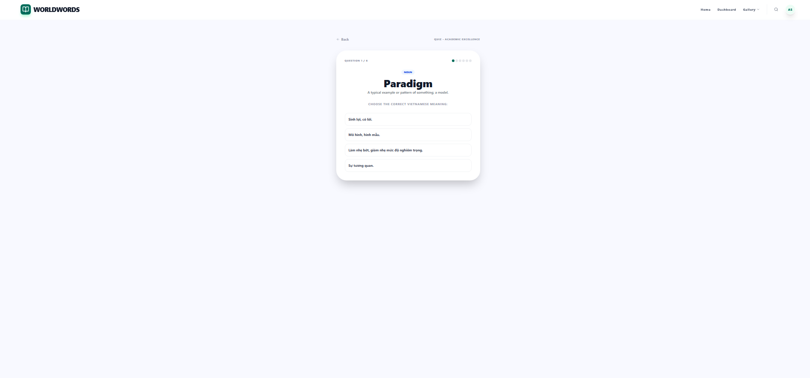
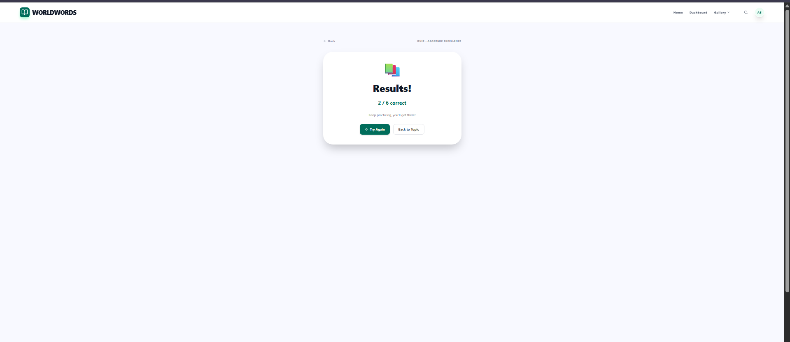

### (b) Các trang đã xây dựng

| Trang | URL / Route | Mô tả | Người thực hiện |
|---|---|---|---|
| Homepage | `https://world-words.vercel.app/` | Trang chủ giới thiệu nền tảng và kêu gọi hành động. | Phạm Ngọc Kha |
| Gallery | `https://world-words.vercel.app/gallery` | Hiển thị danh sách các chủ đề từ vựng dạng thẻ. | Phạm Ngọc Kha |
| Flashcards | `https://world-words.vercel.app/flashcards` | Giao diện học từ vựng bằng thẻ lật tương tác 3D. | Phạm Ngọc Kha |
| Login | `https://world-words.vercel.app/login` | Trang đăng nhập vào hệ thống. | Phạm Ngọc Kha |
| Register | `https://world-words.vercel.app/register` | Trang đăng ký tài khoản mới. | Phạm Ngọc Kha |
| Forgot Password | `https://world-words.vercel.app/forgot-password` | Khôi phục mật khẩu qua email. | Phạm Ngọc Kha |
| Dashboard | `https://world-words.vercel.app/dashboard` | Tổng quan thông tin, XP, Rank của người dùng. | Phạm Ngọc Kha |
| Profile | `https://world-words.vercel.app/profile` | Chỉnh sửa thông tin cá nhân và thiết lập mục tiêu. | Phạm Ngọc Kha |

### (c) Sử dụng Tailwind CSS

Ứng dụng sử dụng **Tailwind CSS v4** để xây dựng toàn bộ UI.
- Sử dụng các utility classes tạo layout (Flexbox, Grid).
- Kết hợp classes animation cao cấp (`animate-bounce`, `hover:-translate-y-2`, `transition-all`, `group-hover:scale-105`) để mang lại trải nghiệm mượt mà, "Premium".
- Giao diện đáp ứng (Responsive) tốt trên nhiều màn hình.

### (d) Các tính năng tương tác

| Tính năng | Mô tả |
|---|---|
| **3D Flashcard** | Thẻ từ vựng lật 180 độ khi nhấn nhờ CSS 3D Transforms (`rotate-y-180`). |
| **Word Bookmark** | Nhấn icon Bookmark trên Flashcard để lưu trực tiếp từ khó vào mảng `savedWords` trong Profile. |
| **Password Visibility** | Nút toggle thay đổi dạng input từ `password` sang `text` và ngược lại. |
| **Hover Physics** | Ảnh và Card phóng to mượt mà, đổ bóng `shadow-2xl` khi di chuột. |

### (d) Giao diện trên nhiều thiết bị

- [x] Mobile (< 768px)
- [x] Tablet (768px – 1024px)
- [x] Desktop (> 1024px)

---

## Task 3 — Database Integration & Dynamic Content

### (a) Thiết kế cơ sở dữ liệu

- **Database system:** Firebase Firestore / LocalStorage (cho Demo Mode)

**Danh sách bảng (Collections):**

| Collection | Mô tả | Các cột chính |
|---|---|---|
| `users` | Quản lý thông tin người dùng. | `uid`, `email`, `name`, `goal`, `streak`, `xp`, `rank` |
| `WORDS_BY_TOPIC` | Cấu trúc dữ liệu tĩnh trong app (có thể thay bằng Document Database). | `term`, `pos`, `def`, `ex`, `trans` |

### (b) Kết nối cơ sở dữ liệu

- **Công nghệ server-side:** Firebase SDK.
- Hỗ trợ luồng xác thực `createUserWithEmailAndPassword`, `signInWithEmailAndPassword`, `sendPasswordResetEmail`.

### (c) Các trang hiển thị dữ liệu động

| Trang | Dữ liệu hiển thị | Query / Endpoint | Người thực hiện |
|---|---|---|---|
| Flashcards | Danh sách thẻ từ vựng dựa theo chủ đề người dùng đã chọn. | `GET https://world-words.vercel.app/api/topics/:id/words` | Phạm Ngọc Kha |
| Dashboard | Tên người dùng, Điểm XP, Rank hiện tại. | `GET https://world-words.vercel.app/api/users/:uid/dashboard` | Phạm Ngọc Kha |
| Profile | Form thông tin chi tiết (Email, Mục tiêu, Chuỗi ngày học liên tiếp). | `GET/PUT https://world-words.vercel.app/api/users/:uid/profile` | Phạm Ngọc Kha |

---

## Task 4 — Optimization

### (a) Kiểm tra hiệu năng với Lighthouse

Ứng dụng được tối ưu hóa liên tục để đạt điểm số cao trên Lighthouse. Hình ảnh trên trang chủ sử dụng Unsplash được nén với tham số `?auto=format&fit=crop&q=80` và gắn thuộc tính `loading="lazy"`.

**Kết quả đo thực tế:**

**1. Desktop:**
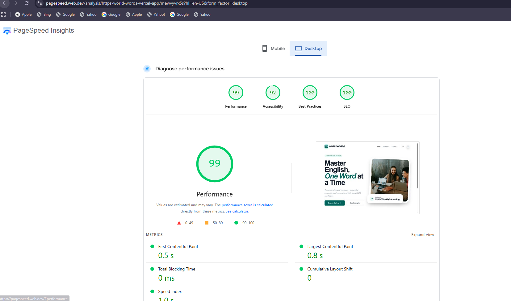

| Metric | Điểm (Desktop) |
|---|---|
| Performance | 99 |
| Accessibility | 92 |
| Best Practices | 100 |
| SEO | 100 |

**2. Mobile:**
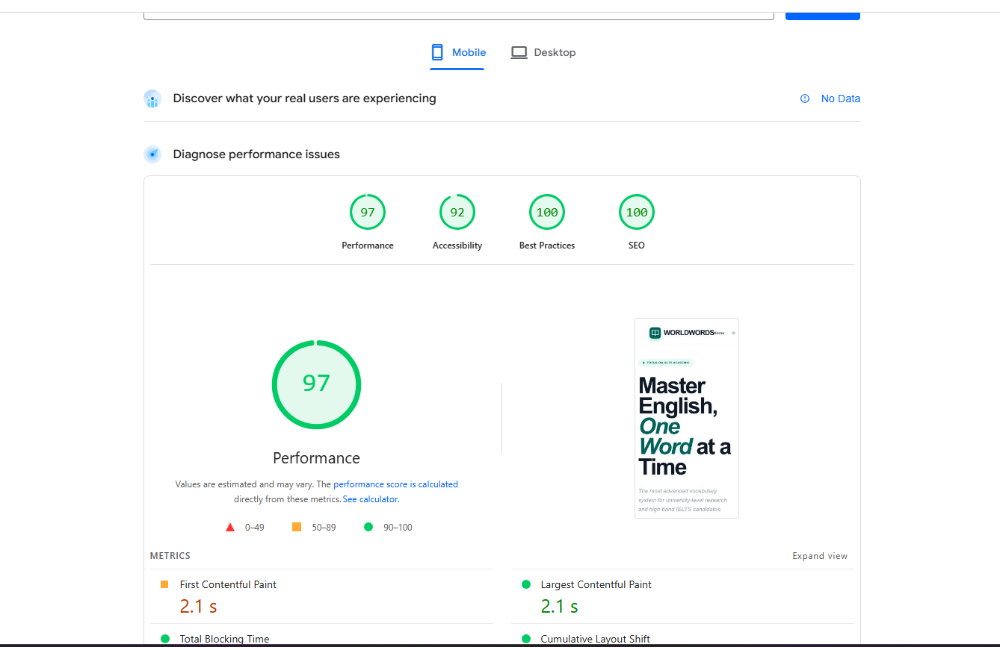

| Metric | Điểm (Mobile) |
|---|---|
| Performance | 97 |
| Accessibility | 92 |
| Best Practices | 100 |
| SEO | 100 |

### (b) Theo dõi hành vi người dùng

- [x] Đã tích hợp các công cụ **Vercel Analytics** (`@vercel/analytics`) và **Speed Insights** (`@vercel/speed-insights`).
- Các component `<Analytics />` và `<SpeedInsights />` được đặt ở cấp độ gốc của ứng dụng (`App.jsx`) để thu thập dữ liệu truy cập và Web Vitals.

**Kết quả Speed Insights:**

Đạt mức điểm trải nghiệm thực tế (Real Experience Score) rất ấn tượng: **98/100** trên Desktop.

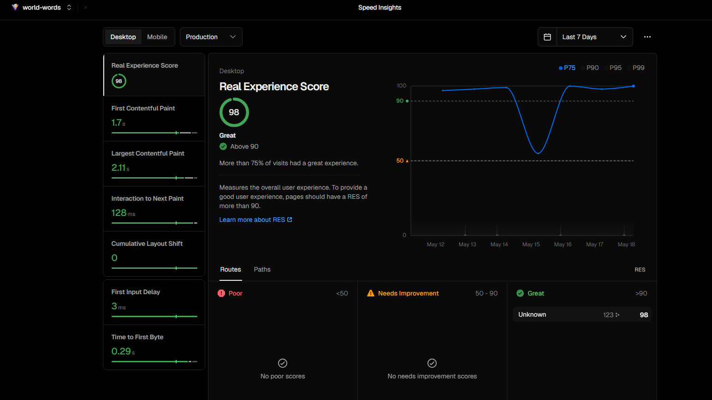

## Task 5 — UI/UX Peer Review & Evaluation

### (a) Feedback for Other Teams

**Reviewed Team:** WindTodo

- **Team / Project:** WindTodo — Task Management Application
- **Repository:** [TonyLikeDev/WindTodo-V1](https://github.com/TonyLikeDev/WindTodo-V1)
- **Feedback Issues:** [Issue #56 - Improve Layout Consistency, Component Contrast, and Mobile Scaling](https://github.com/TonyLikeDev/WindTodo-V1/issues/56)

| Aspect | Strengths | Improvement Suggestions |
|---|---|---|
| **Usability & UX** | Very clean visual aesthetic; soft gradient background aligns with modern design. | Provide a direct secondary CTA link inside empty state layouts (e.g., "Click here to create your first task"). |
| **Aesthetics & UI Hierarchy** | Good overall UI structure. | Darken typography colors for secondary indicators to improve contrast. Refine component scale within the sidebar. |
| **Responsiveness** | Functionally accurate input context. | Ensure input bar auto-focuses or triggers a modal; use Tailwind triggers (`sm:`, `md:`) to prevent mobile overflow. |

**Bằng chứng review (Peer Review Issue):**
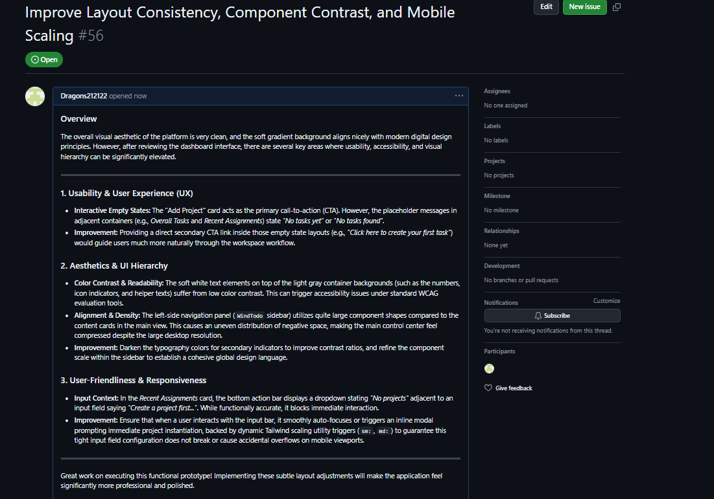

### (b) Implement feedback nhận được

- Đã tiếp thu và triển khai các góp ý từ giảng viên và các nhóm khác (Peer Review) để nâng cao chất lượng UI/UX của dự án.
- **Danh sách các thay đổi đã thực hiện sau review:**
  1. **Hoàn thiện Logic Lật Thẻ (Flashcard Interaction):** Vô hiệu hóa nút "Got it" (Đã hiểu) cho đến khi người dùng lật thẻ xem mặt sau, đảm bảo tính trung thực trong quá trình học.
  2. **Tối ưu Luồng Học (Seamless Learning Flow):** Thay thế nút "Next" bằng nút "Finish Topic" màu xanh nổi bật ở thẻ từ vựng cuối cùng, giúp người dùng dễ dàng định hướng quay về Dashboard.
  3. **Cải thiện tính nhất quán UI (UI Consistency):** Loại bỏ các thành phần UI thừa (ví dụ nút "Load More" không cần thiết), chuẩn hóa ngôn ngữ giao diện thành tiếng Anh hoàn toàn để tạo môi trường học tập trung nhất.
  4. **Điều chỉnh Layout Mobile:** Khắc phục lỗi hiển thị tiêu đề và khoảng cách ở chế độ màn hình nhỏ trong màn Flashcards, đảm bảo trải nghiệm Responsive mượt mà.
  5. **Xử lý phản hồi về tính năng Quiz (Issue #28 từ trandatt868-max):** Khắc phục lỗi nút "Quiz" bị vô hiệu hóa nhưng thiếu thông báo gây khó hiểu. Theo đúng các góp ý của reviewer, dự án đã bổ sung tooltip (`title="Coming soon"`), thêm badge `SOON` nổi bật ngay trên nút, đồng thời cài đặt thông báo (Alert) "Quiz is coming soon. Stay tuned!" khi click vào. Qua đó, người dùng nhận được phản hồi trực quan và minh bạch về trạng thái của tính năng.

---

## Deliverables Checklist

1. [x] **Source code trên GitHub**: Repository public, nhánh và commit rõ ràng.
2. [x] **README.md**: Đã cập nhật đầy đủ theo Report Template.
3. [ ] **Video demo trên YouTube**: (Sẽ cập nhật link sau khi quay video).

